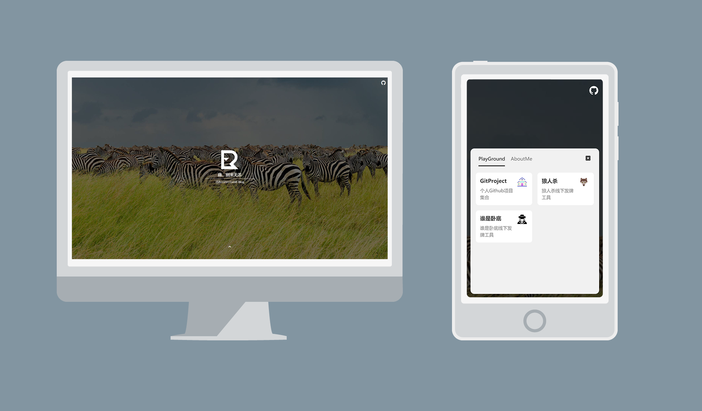

# 1. 关于

Blog-Index 通用网站导航


[预览链接](https://blog-index.esunr.xyz) | [友链交换区](https://github.com/EsunR/Blog-Index/issues/53) | [更新日志](./CHANGELOG.md)



这是一个基于 Vue 的通用网站导航页面，你可以将其放在个人网站的首页作为您博客的引导页面或者是您其他项目的引导页。使用自适应布局兼容多端显示，方便游客浏览您的个人网站，背景图来自于 Bing 每日图片。

# 2. 使用方法

## 2.1 自动部署

### 一键部署

> 该方式无法保持更新，如果想要保持更新，请不要使用该方式，并参考下面的『保持更新』。

点击按钮一键部署到 Vercel：

[](https://vercel.com/new/clone?repository-url=https%3A%2F%2Fgithub.com%2FEsunR%2FBlog-Index&repository-name=Blog-Index)

### 保持更新

使用上面的一键部署后，Vercel 会默认为你创建一个新项目，而不是 fork 本项目，这会导致无法从 Github 上获取本项目的更新状态。你可以参考下面的教程手动 Fork 本项目，使用 Vercel 部署，并持续跟进本项目的更新。

图文教程：[《使用 Vercel 全自动部署个人网站》](https://blog.esunr.xyz/2022/07/0cce6064286a.html)

### 修改配置

进入到刚才由 Vercel 创建或你自己手动 Fork 的本项目 Github 仓库，并找到 `/src/config.ts` 文件，点击『编辑』按钮修改文件中的内容：


Website 抽屉配置：

```ts
const WEBSITE_SORTS: WebsiteSort[] = [
  {
    title: "示例分类1",
    sites: [
      {
        /** 网站标题 */
        title: "主标题",
        /** 网站 url */
        url: "http://www.your-web-page.com/",
        /** 网站 icon 图标，非必填，留空默认展示网站标题的第一个字符 */
        icon: "",
        /** 指定网站 icon 背景色 */
        color: "#0171CD",
      },
    ],
  },
  // ... ...
];
```

等待 Vercel 重新部署即可。

## 2.2 手动部署

### 拉取代码并安装依赖

本地环境要求（可使用 volar 自动切换环境）：

- node >= 18
- yarn 1.22.19

拉取代码并安装依赖：

```sh
git clone https://github.com/EsunR/Blog-Index.git
cd ./Blog-Index
yarn install
```

### 按需修改配置文件

修改 src/config.ts 文件中的内容，同上。

### 打包编译

```sh
yarn build
```

将 dist 目录下的文件部署到服务器即可。

# 3. 开发

本地环境要求（可使用 [volta](https://blog.esunr.site/2023/07/d99593770741.html) 自动切换环境）：

- node >= 18
- yarn 1.22.19

拉取代码并安装依赖：

```sh
git clone https://github.com/EsunR/Blog-Index.git
cd ./Blog-Index
yarn install
```

启动开发模式：

```sh
yarn dev
```

# 4. 未来计划

- [x] 使用 Vite + Vue3 + Typescript 搭建项目
- [x] 优化代码结构，减轻包体积
- [x] 重构已有功能
  - [x] 重构首页组件
  - [x] 重构抽屉组件
- [x] 采用 SSG 构建静态页面
- [ ] 优化配置文件，加入主题相关配置
- [ ] 更好的 seo
- [ ] 自动暗夜模式
- [ ] 加入站点统计
